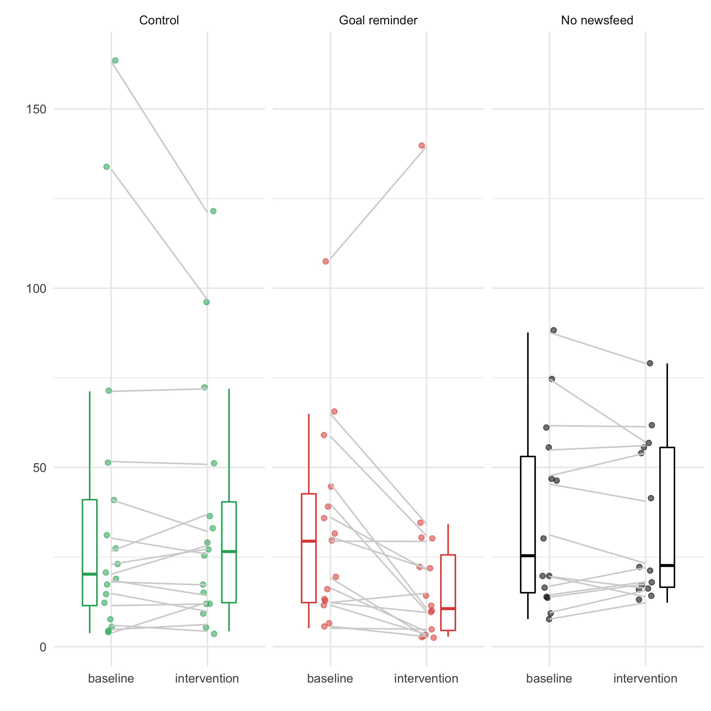

# simple-raincloud-plot
This is a simple visualisation for repeated measures experiments.

Inspired by [RainCloud](https://github.com/RainCloudPlots/RainCloudPlots) plots.

The code and example data will generate this visualisation for a repeated measures experiment with three different conditions, and a baseline and intervention score for each participant:

